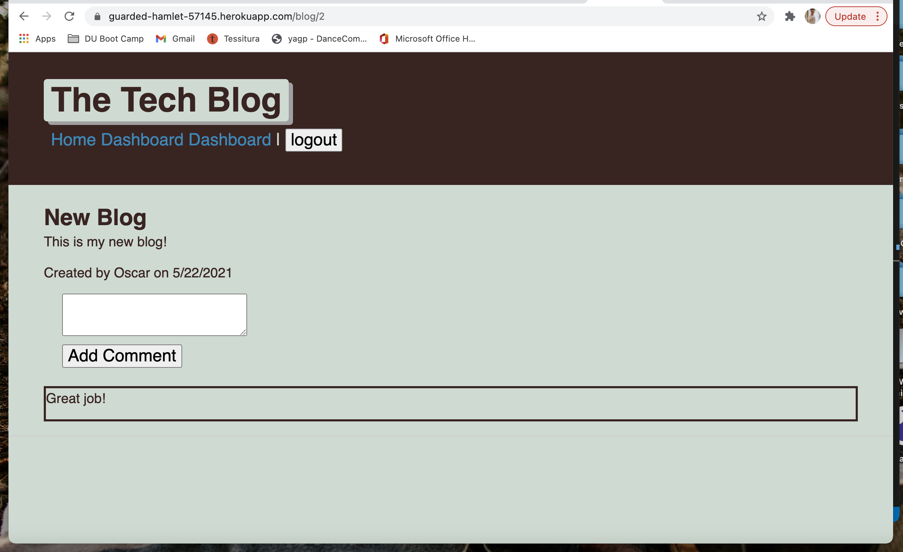

# 14-Model-View-Controller-MVC-Tech-Blog

# Table of Contents

1. [Description](#Description)
2. [Features](#Features)
3. [Installation](#installation)
3. [License](#License)
4. [Contributing](#Contributing)
5. [Questions](#Questions)
6. [Screenshot](#screenshot)

# Description 

My task was to build a tech blog. I configured a working Express.js API to use Sequelize to interact with a MySQL database.

# Features
- Express.js
- Node.js
- NPM
- MySQL
- Sequelize
- dotENV
- express-handlebars
- bcrypt

# License

## This application is covered by the MIT license. 

# Contributing
Contributions are excepted. Fill free to fork. 

# Questions
## GitHub User name 
ashleykohladler

### Link to GitHub:
https://github.com/ashleykohladler/14-Model-View-Controller-MVC-Tech-Blog

### Link to Heroku:
https://guarded-hamlet-57145.herokuapp.com/

### Email address 
ashleykohladler@gmail.com

### Screenshot

 

